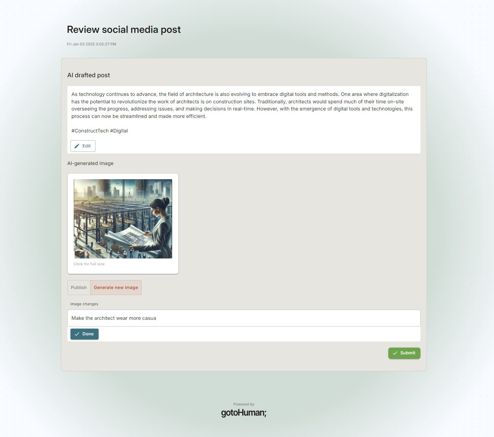

<div align="center">


</div>

# gotoHuman - Human in the Loop for AI workflows

[](https://opensource.org/licenses/MIT)
[](https://github.com/gotohuman/gotohuman-js-sdk)
[](https://github.com/langfuse/langfuse)
[](https://discord.gg/yDSQtf2SSg)

[gotoHuman](https://gotohuman.com) helps you build production-ready AI workflows by making it really easy to include human approvals. Keep a human in the loop to review AI‑generated content, approve critical actions or provide input.

Set up a fully customized review step capturing any relevant data (text, images, markdown,...) and required human input (buttons, checkboxes, inputs,...). Then trigger it from your application whenever human review from your team is needed.

### Install

`npm install gotohuman`

### Init

```
const gotoHuman = new GotoHuman(GOTOHUMAN_API_KEY)
```

### Send request

[Read the docs](https://docs.gotohuman.com/send-requests) for more details.

Example request:
```
const reviewRequest = gotoHuman.createReview(GOTOHUMAN_FORM_ID)
    .addFieldData("exampleField1", value1)
    .addFieldData("exampleField2", value2)
    .addMetaData("threadId", threadId)
    .assignToUsers(["jess@acme.org"])
await reviewRequest.sendRequest()
```

#### Example review

